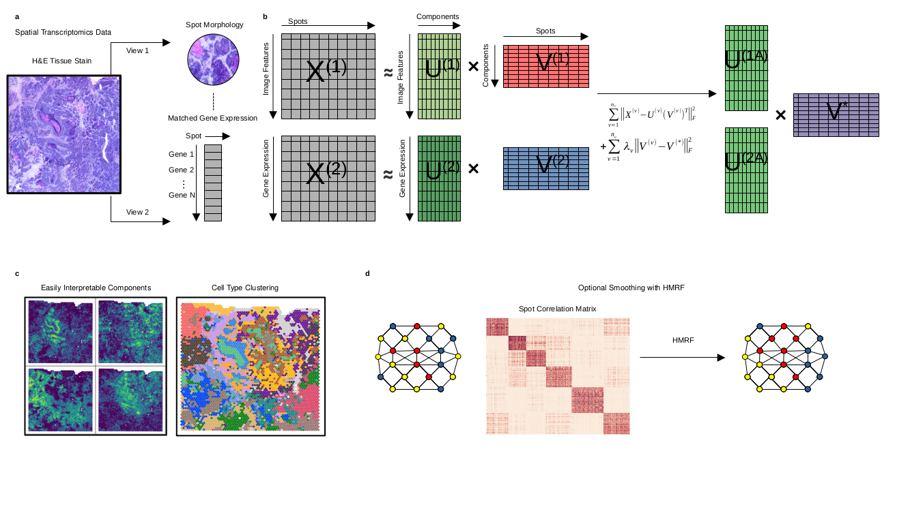

# Overview of MultiNMF



MultiNMF is a multi-modality clustering algorithm which leverages a probabilistic latent variable model to find lower dimensional factorizations of inputted data that produces a common consensus between clustering solutions across multiple views. The utility of MultiNMF allows the simultaneous analysis of spatial transcriptomic expression and morphological features from tissue images [H&E], with the possibility to expand analysis to additional modalities of data.

MulitNMF can be applied to any type of spatial transcriptomics data, including MERFISH, seqFISH, and Visium, and other spatial omics data.

# Running MultiNMF

## Installation

Python package dependencies:
- os
- argparse
- numpy
- pandas
- scikit-learn
- scipy
- seaborn
- matplotlib
- tensorflow
- cv2
- caffe_classes
- alexnet
- time

### Install MultiNMF
```
git clone https://github.com/WilliamZBowie/MultiNMF.git
cd MultiNMF  # the directory of the cloned repository
pip install -e .
```

### Step 1: Preparing input files

All files for one run of MultiNMF must be reference correctly at runtime. For each sample of `N` cells and `G` genes, the following three files stored as tab-delimited txt format are required for MultiNMF. Example inputs can be found under the Data file:

- `expression.txt`, an `N`-by-`G` nonnegative-valued matrix of normalized single-cell expression profiles. This expression matrix must be appropiately preprocessed and normalized.
- `barcodes.txt`, a one collumn text file which represents a list of cell/spot identifiers no headers and in the same order as the row order of the expression.txt matrix.
- `morphology.tiff`, a image file of the respect capture area for the sample being anaylsized. Higher resolution leads to better results. 
- `barcodes.txt`, a two collumn text file which represents a list of cell/spot coordinates as x and y integer values with no headers and in the same order as the row order of the expression.txt matrix. Note the coordinates must align to pixels in the morphology image and have the correct 1 to 1 scale. 

### Step 2: Running MultiNMF
#### Running MultiNMF from command line

All code is contained within the MultiNMF folder. The script `run_MultiNMF.py` runs the program.


MultiNMF requires a few arguments to specify the input files and hyperparameters. Below is the table of the description of all arguments:

#### Input related parameters
| params | type | description | example |
|-|-|-|-|
| --view_files      | str | path to expression matrix or additional modalities of data | "./expression.txt" |
| --view_types      | str | specifies view types of inputted files | "expression" "morph" |
| --cell_coordinates| str | path to cell coordinate file | "coords.txt" |
| --cell_names      | str | path to barcode file | "barcodes.txt" |
| --image_file      | str | path to image file | "morph.tiff" |
| --output_dir      | str | path to output directory | "~/path/output/" |

#### Hyperparameters

| params | type | description | example |
|-|-|-|-|
| -K                      | int | Number labels of components to factorize views into | 15 |
| -k                      | int | Number of clusters to cluster components into | 15 |
| -k_init                 | int |Number of initializations for Kmeans | 10000 |
| -view_weights           | int |Weights to tune influence of individual views to overall consensus of clustering structure, recommended 0.01 per view | 0.01 0.01 |
| -size                   | int |Spot size for visualization plots | 20 |
| -color                  | str |String to specify seaborn color palette, see https://seaborn.pydata.org/tutorial/color_palettes.html | "husl" |
| -HMRF                   | bool | Boolean specifying whether to use optional HMRF smoothing | True |
| -normalize              | bool | Boolean specifying whether normalize MultiNMF by 95th percentile of component values | True |
| -rank_weight            | int | Weight of ranked_based clustering. Value recommended 0.995 or higher| 0.995 |
| -beta_range             | float | 'Specify range of number of rounds and increment values to be used for HMRF (start,end,step)| [0,10,0.5] |
| -HMRF_tolerance         | float | Tolerance threshold for HMRF | 1e-20 |
| -HMRF_init              | int |Number of initializations for HMRF | 10000 |

### Run MultiNMF Command
```
# Example Command Line prompt
python3 run_MultiNMF.py --view_files expression.txt --view_types expr --cell_coordinates coordinates.txt --cell_names barcodes.txt --image_file morph.tif --scale_factor 71 --output_dir ./Results --view_weights 0.01 0.01 --K 20 --k 10 --k_init 1000 --normalize True

```
### Outputs

All outputs can be found in output directory. Outputs include a folder containing image crops created from morphology image and used for analysis and an example png showing how coordinates align to original image. The vectorized morphology matrix generated from image crops using AlexNet. The factorized component matrices generated from MultiNMF labeled and MultiNMF_outs. Cluster labels produced from kmeans as well as a visualization using imputed coordinates. And finally a folder with the MultiNMF components individually visualized. 

**MultiNMF_outs.npy:** File containing NMF factors and weights in matrix form for indivdual views and one joined consensus view <br>
**Morphology.npy:** Vectorized morphology matrix generated from image crops using AlexNet <br>
**Rank_Matrix.npy**: Rank matrix generated during HMRF <br>
**cluster_labels.txt**: Final Cluster labels returned in same order as barcodes.txt <br>
**image_crops_sample_coordinates.png**: An example png showing how coordinates align to original image <br>
**MultiNMF_Clusters.png**: Visualization of clustering labels overlaid on spatial coordinates <br>

#### Output Directory Structure
├─ **OUTDIR** <br>
│   ├──MultiNMF_outputs.npy<br>
│   ├──Morphology.npy.png<br>
│   ├──Rank_Matrix.npy<br>
│   ├──cluster_labels.txt<br>
│   ├──image_crops_sample_coordinates.png<br>
│   ├──MultiNMF_Clusters.png<br>
**│   ├── image_crops**<br>
│   │   ├──*barcode.png<br>
***│   │   ├── features***<br>
│   │   │   ├──*barcode.npy<br>
**│   ├── Visualized_Components**<br>
│   │   ├── Round x <br>

## Installation and Usage for MultiNMF
check: https://github.com/WilliamZBowie/MultiNMF/wiki
